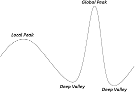
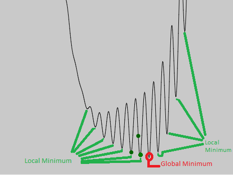
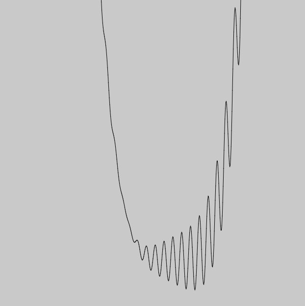

# PSO Hybridization with GA

## Introduction ##

We are hoping to find a faster method of searching through a solution space by using a hybridization of Particle Swarm Optimization and Genetic Algorithms. In viewing the difference between both the strengths and weaknesses of both algorithms we have hypothesized that combining the two may overcome the other's faults. This application using both algorithms together, could potentially find better solutions faster, and more efficiently then just using Genetic Algorithms, or Particle Swarm Optimization alone.

## Test Functions ##
To test the hypothesis that a Particle Swarm Optimization hybridization with Genetic Algorithms would be a viable option, a decision was made to test these two optimization algorithms on a few different 2 dimensional functions. The goal for the algorithm would to be search these 2 dimensional solution spaces and find the global minimum value.

## Genetic Algorithm ##

### The Algorithm ###

A Genetic Algorithm is a process that emulates the steps of natural selection to generate accurate 
solutions.

from [geeks for geeks](https://www.geeksforgeeks.org/genetic-algorithms/)

1. initialize a population of random binary strings
2. Determine fitness of each individual in that population
3. Until Solution Reached repeat:
    1. Select parents from population
    2. Crossover and generate new population
    3. Perform mutation on new population
    4. Calculate fitness for new population
    

     
### Population ###

- Our Population of individuals will consist of binary strings. these binary strings will be converted later on into decimal values that will represent x before we plug them into a function to find y.

### Calculate Fitness ###

- To calculate the fitness of an individual that individual will be converted into a decimal value be plugged and be plugged into the selected function.
- the fitness value of each individual is the y value from the function that has been selected.
- During selection the lower the y value (fitness) the more likely that individual will be used in crossover.

### Selection of Parents: ###

   - There are few different ways selection can be implemented, in this project we will be using tournament process, although the selection process should in function just provide a way for selecting new parents for the new generation by prioritizing individuals with a more desired fitness. (in this project's case the lower fitness the better)

#### Tournament Process: ####
   - Tournament will select 2 random individuals from the population and pick the one which has the lowest fitness
   - Tournament will happen twice, to find two fit parents for cross over
   
### Crossover: ###
- Create a cross over point by generating a random integer in-between 1 and the length of the chromosome
- Use that number as a crossover point 
- create a new individual using 2 parents taken from Selection of Parents, by splitting the first and second parent from the index of the crossover point

  
### Perform Mutation: ###
- Mutation  will  occur  based  on  a  specific  rate,  and  will  change  one  random  gene  in  the 
chromosome 

## GA Deceptive Cases ##

One of the setbacks that Genetic Algorithms run into, is the ability to be decieved. Deceptive problems can ruin the chance of finding an accurate solution.

For  example,  (using  this  graphic)  if 
we were to use a GA to find the local 
minimum  of  this  line  it  would  go  to 
the first deep valley it see’s and not 
move to the next. The reason for this 
is    because    of    how    the    fitness 
function   works.   Each   generation 
every individual gets tested to see if 
they  have  a  high  fitness.  If  they  do 
they  have  a  greater  chance  of  having  their  genes  passed  on.  Unfortunately  any 
chromosomes  that  try  and  climb  the  giant  curve  to  get  the  global  minimum  will 
have lower fitness values. So they don’t have a high chance of being put into the 
next generation making it very hard for them to pass on their genes. To get to the 
global minimum.

#### Representation: #### 

A way to get around this problem is to implement higher mutation rates to allow the algorithm to search the solution space with more success. Although changing the mutation rate can lead to too much random variation which leads to the population never converging onto an actual solution.

#### Genetic Algorithm with a high mutation rate: #### 

## Particle Swarm Optimization ##

A Particle Swarm Optimization Algorithm (PSO) is a stochastic optimization algorithm that uses a population of particles that communicate with each-other and move via vectors through a solution space to the "best solution". The visualization of PSO looks almost like a swarm of bee's in the beginning, this is due to swarm's technique of searching a solution space. PSO is great for large solution space's, multi dimensional solution spaces, as well as very accurate solutions in the case of 2D functions.

#### Visualization: ####

### The Algorithm ###

from [swarmintelligence.org](http://www.swarmintelligence.org/tutorials.php)

1. initialize a population of particles with random positions
2. Determine fitness of each particle in the population
3. give each particle a pbest variable which stores the particles best ever position (pBest)
4. choose the particle with the best fitness and store it's position in the swarm as (gBest)
3. Until Solution Reached repeat:
    1. calculate each particles velocity
    2. update each particle position
    3. if applicable set pBest for each particle
    4. if applicable set gBest in swarm

## Calculating Each Particle's Velocity ##

#### formula ####
This formula is used to update each particle's velocity in the swarm:

    newVelocity[] = i * v[] + cc * rand() * (pbest[] - present[]) + sc * rand() * (gbest[] - present[])

#### variables ####
**v[]** = particle's velocity vector

**present[]** = particle's current position vector 

**pbest[]** = particles best saved position vector

**gbest[]** = swarms best saved position vector

**cc** = cognitive Component (decided by user)

**sc** = social Component (decided by user)

**i** = inertial Component (decided by user)

**rand()** = random number between 1-2

## Updating Each Particle's Position ##

#### formula ####
This formula is used to update each particle's velocity in the swarm:
           
     newPosition[] = present[] + v[]
     
#### variables ####
**v[]** = particle's velocity vector

**present[]** = particle's current position vector      
 
### Decided Variables ###

for this particular project it has been decided that these variables will be used in particle swarm.

**Cognitive Component** = 1.496180

**Social Component** = 1.496180

**Inertial Component** = 0.729844

## PSO & GA Compared ##

The reason behind combining the two algorithms together is because both algorithms contain weaknesses in which the other is strong in. for example:

**Genetic Algorithms:** converge quickly although because of deceptive cases, are innaccurate.

**Particle Swarm Optimization:** converge slowly although are more accurate because of how much ground they cover

